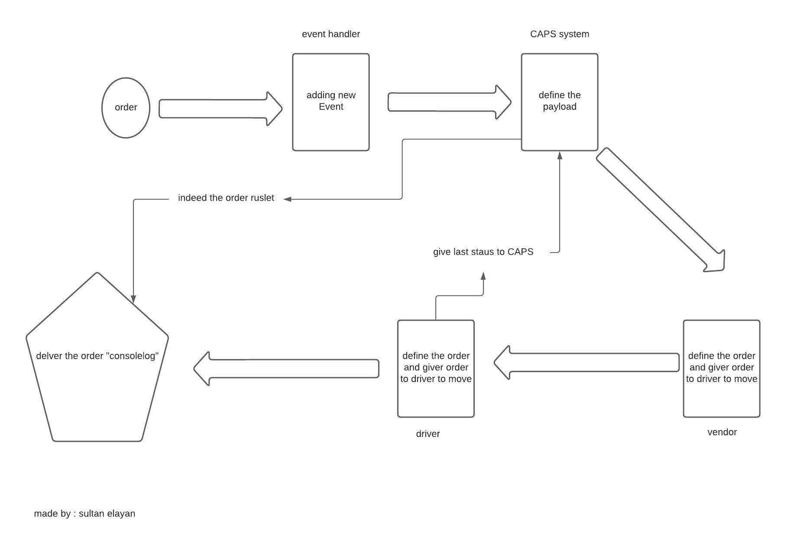
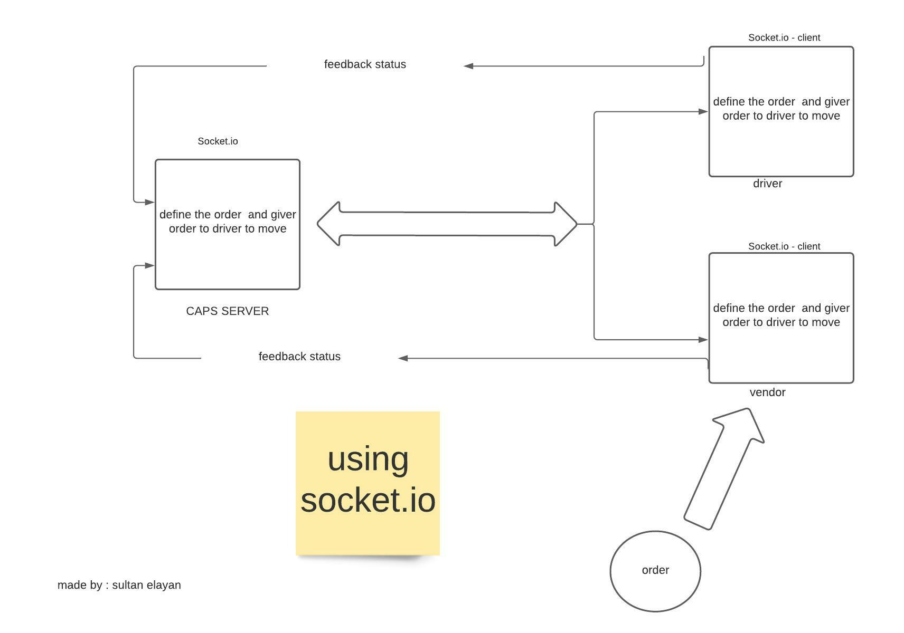
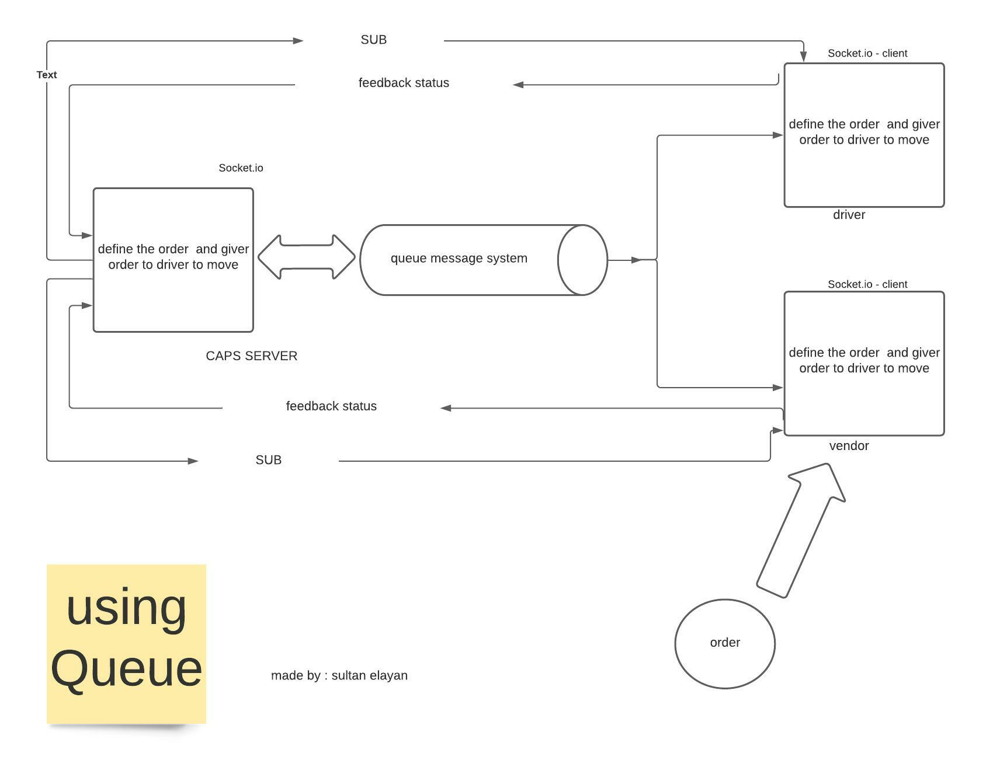
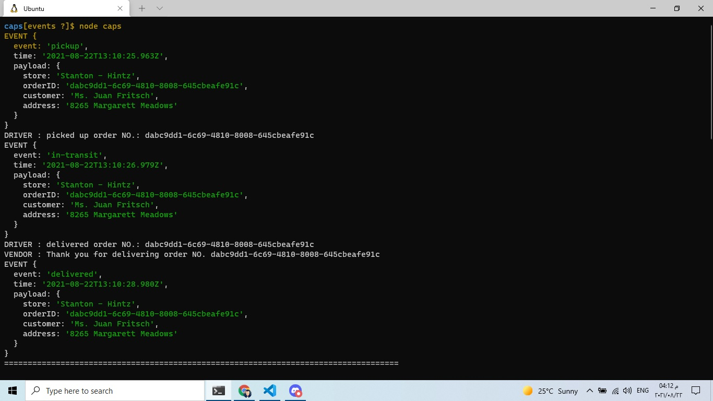
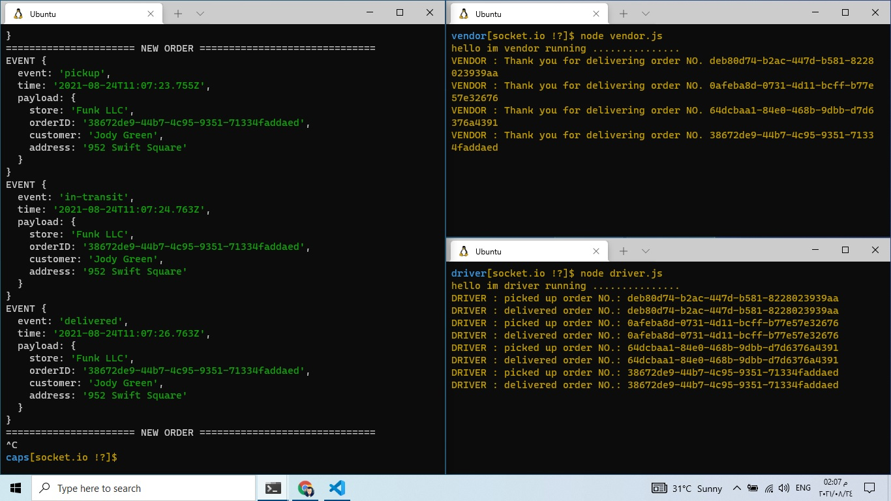
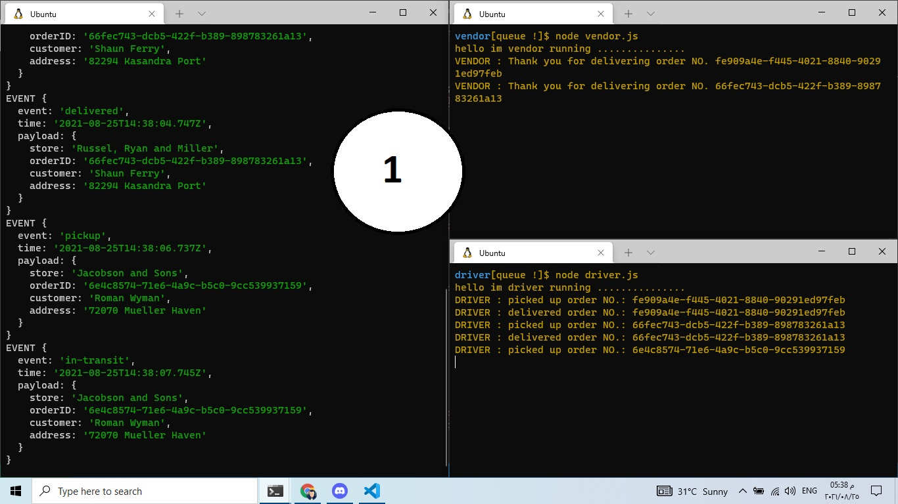
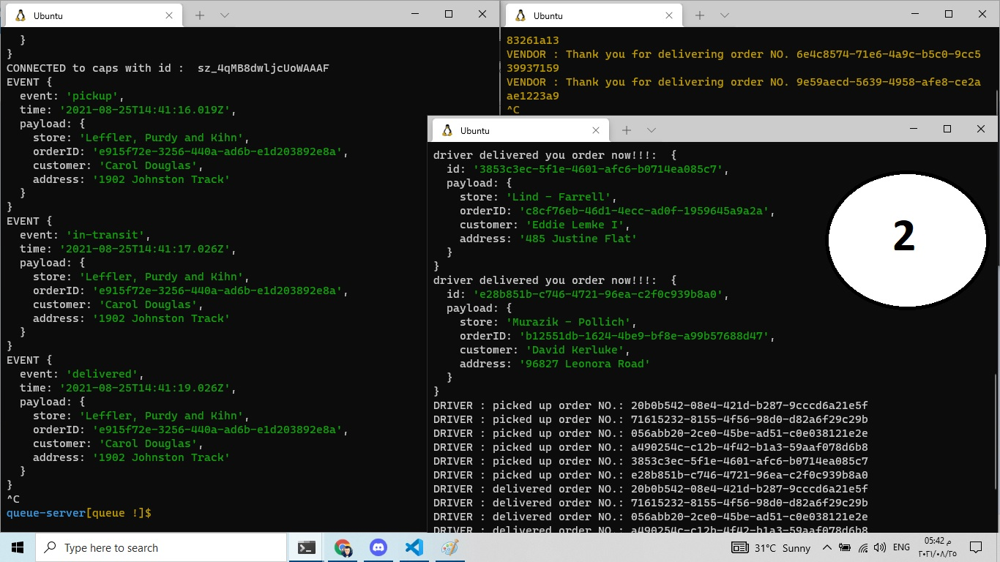

# caps & socket.io

## NOTES

1. how to handel with event loop
2. the process in the handel loop 
3. using fake and library and the internal package events
4. how to use socket.io in server

## Provided Link

- repo action -->> [repo action](https://github.com/sultan-elayan/caps/actions)
- PR -->> [PR](https://github.com/sultan-elayan/caps/pull/1)
- PR2 -->> [PR2](https://github.com/sultan-elayan/caps/pull/3)
- heroku -->> [heroku deployment](https://sultan-event-driven.herokuapp.com/)

# MUL

- ##  CAPS

- ##  socket.io

- ##  Message-Queues

# TEST

## CAPS - TCP 

## CAPS - Socket.io 

## QUEUE

- in this status : every thing go will 

- in this status : the driver stop receiving the orders so 
queue message start to save orders and stop in pickup 
then when the driver be on-line , all the orders come together and he received them with ID and he pickup them and delivered them
